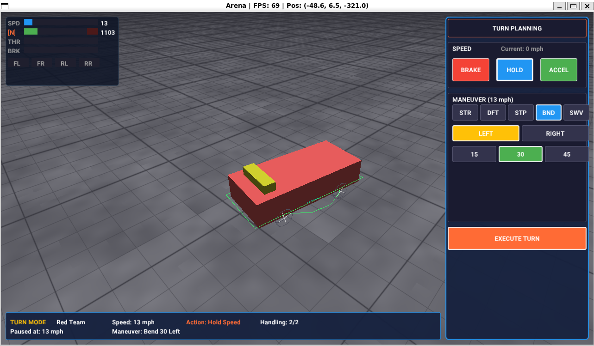

# Arena Combat Engine

A 3D turn-based vehicular combat engine inspired by classic tabletop games.

## Project Status

**This is an educational/prototype project.** It is not affiliated with, endorsed by, or connected to any commercial game or trademark holder. The project explores concepts inspired by classic tabletop vehicular combat games for learning purposes only.

## What This Is

- A turn-based vehicular combat game where you plan your moves, then watch physics execute them
- Faithful to tabletop mechanics: simultaneous planning, phased movement, handling rolls
- Physics replaces rulers and turning keys - you pick a maneuver, the engine drives the arc
- Built in C++ with SDL2, OpenGL, and Jolt Physics

## What This Is NOT

- A real-time arcade game (not Twisted Metal)
- A racing simulator
- A commercial product

## Current Features

### Turn-Based System
- Pause to plan, unpause to execute
- Multi-phase turns (1-5 phases based on speed, per tabletop rules)
- Ghost path preview shows planned movement before execution
- Speed changes during turns (accelerate/brake)

### Maneuvers (Implemented)
- **STRAIGHT** (D0) - Forward movement
- **DRIFT** (D1) - 1/4" lateral shift, maintain heading
- **STEEP DRIFT** (D3) - 1/2" lateral shift
- **BEND** (D1-D6) - Arc turns: 15°, 30°, 45°, 60°, 75°, 90°

### Physics
- Jolt Physics engine for vehicle dynamics
- Kinematic animation for predictable maneuver execution
- Wheeled vehicle simulation with suspension
- Collision detection with arena walls and obstacles

### Rendering
- SDL2 window with OpenGL 4.x context
- Chase camera with smooth follow and mouse orbit
- Arena with walls and obstacles
- Debug visualization for physics bodies

## Screenshots



## Building

### Ubuntu / Debian / WSL2

Install dependencies:

```bash
sudo apt update
sudo apt install build-essential cmake libsdl2-dev libglew-dev
```

Jolt Physics is fetched automatically by CMake.

Build and run:

```bash
cd client
./build.sh        # Build the client
./run.sh          # Run (auto-detects WSL2 GPU acceleration)
./run.sh --build  # Build and run in one step
```

## Controls

### Turn-Based Mode (Default)

- **Tab**: Pause/unpause physics (pause to plan, unpause to execute)
- **Left/Right**: Select phase (when paused)
- **Up/Down**: Cycle maneuvers for selected phase
- **Shift + Left/Right**: Change maneuver direction
- **Space**: Execute turn (when paused)

### Freestyle Mode

- **W/S**: Accelerate / Brake
- **A/D**: Steer left / right
- **V**: Toggle cruise control
- **[/]**: Cruise speed down/up (snap to 10 mph increments)

### Camera

- **C**: Toggle chase camera (follows selected vehicle)
- **Right-click + drag**: Orbit camera
- **Scroll**: Zoom in / out

### General

- **F**: Toggle between Turn-Based and Freestyle modes
- **G**: Toggle ghost path preview
- **P**: Toggle physics debug visualization
- **H**: Toggle vehicle visibility
- **R**: Reload vehicle config
- **ESC**: Quit

## Project Structure

```
client/                 # Game client (C++/OpenGL)
  src/
    game/               # Maneuvers, handling, config loaders
    physics/            # Jolt Physics integration
    render/             # Shaders, camera, mesh rendering
    ui/                 # UI panels and text
    platform/           # SDL2 window/input
    math/               # Vector and matrix math

assets/                 # Game assets
  data/
    vehicles/           # Vehicle JSON configs
    equipment/          # Suspension, tires, power plants
  config/scenes/        # Arena definitions
  shaders/              # GLSL shaders

server/                 # Game server (Go) - planned
docs/                   # Design documents
```

## Documentation

- [ROADMAP.md](docs/ROADMAP.md) - Development status and planned features
- [CONFIG_GUIDE.md](docs/CONFIG_GUIDE.md) - Vehicle and physics configuration
- [MANEUVERS.md](docs/MANEUVERS.md) - Maneuver system details

## License

See [LICENSE](LICENSE) for details.

## Disclaimer

This is an independent fan project created for educational and personal use. It is not affiliated with, endorsed by, sponsored by, or in any way officially connected with Steve Jackson Games, the Car Wars franchise, or any of their subsidiaries or affiliates.

Car Wars, AADA, Autoduel, and Uncle Albert's are trademarks of Steve Jackson Games Incorporated. All other trademarks are the property of their respective owners.

The use of any trade name or trademark is for identification and reference purposes only and does not imply any association with the trademark holder.

This project is provided "as is" without warranty of any kind. The author makes no representations regarding the accuracy, completeness, or suitability of this software for any purpose.
